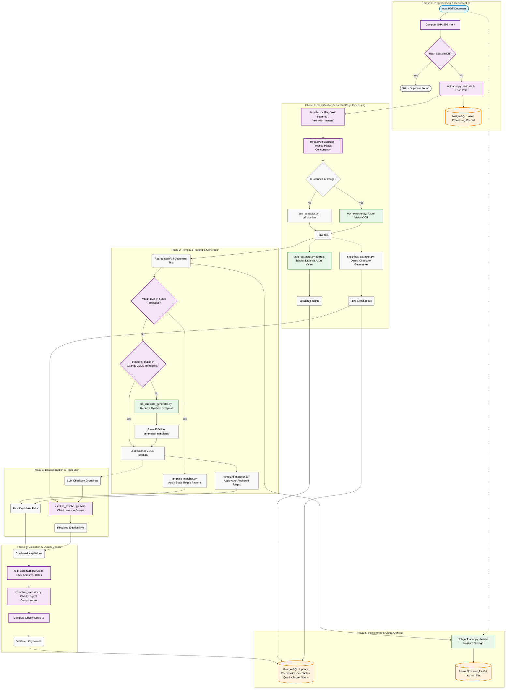

# PDF Ingestor Pipeline - Technical Architecture

This document provides a highly detailed architectural diagram of the PDF Ingestor pipeline, tracking a document from upload through final database persistence.

### Diagram Highlights
1. **Preprocessing**: The system uses `hashlib.sha256` to short-circuit processing if the exact same file was already processed.
2. **Parallel Extraction**: The `ThreadPoolExecutor` dispatches pages concurrently to Azure Vision (for OCR/tables) and native extractors.
3. **Template Routing**: It favors fast local execution (Static Templates -> Cached Fingerprints) before calling out to Azure OpenAI for dynamic regex generation.
4. **Resolution**: Checkboxes identified visually in Phase 1 are mapped to semantic meanings defined by the LLM in Phase 2.
5. **Quality Control**: Data is validated and scored before final insertion into PostgreSQL.
