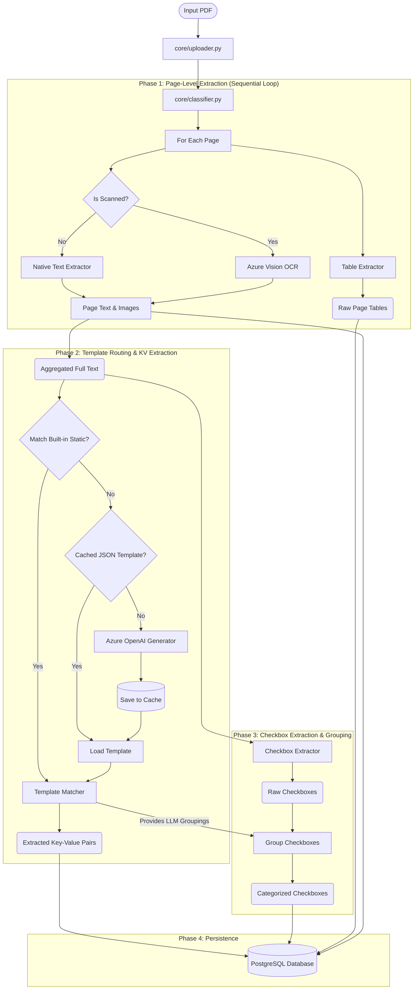
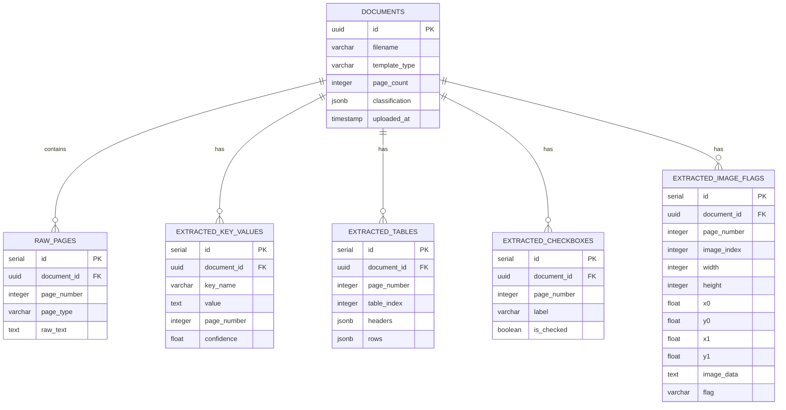

# Technical Documentation & Architecture

## Overview
The PDF Ingestor is a modular, scalable Python application built to extract structured data from diverse, unstructured PDF documents. It supports natively generated text PDFs, fully scanned images, and mixed pages.

The pipeline processes documents page-by-page, determining the optimal extraction strategy (Text vs. OCR) to maintain performance and accuracy, before applying template matching to extract targeted business logic points and inserting the results into a relational database.

For **unknown PDFs** that don't match any built-in template, the system dynamically generates extraction templates using **Azure OpenAI**, caching them for future reuse so the LLM is never called twice for the same form type.

---

## 1. System Architecture



### Flow Breakdown
1. **Ingestion**: `core/uploader.py` validates the file type, checks file integrity, and opens the document via `pdfplumber`.
2. **Classification**: `core/classifier.py` evaluates the density of the text layer on a given page versus the presence of embedded images to flag the page type.
3. **Phase 1: Page-Level Extraction (Sequential)**:
    - Processed sequentially page-by-page to prevent excessive memory usage.
    - **Native Text**: Handled purely by `extractors/text_extractor.py`.
    - **Images & Scans**: Handled by `extractors/ocr_extractor.py` which uses **Azure OpenAI Vision** for high-accuracy, layout-preserving text recognition.
    - **Tables**: `extractors/table_extractor.py` utilizes native metadata grids (`pdfplumber`) as the primary engine inside the page loop.
    - **Signatures & Images**: During iteration, embedded images undergo an OpenCV Edge Density Variance check. High variance images (signatures) are cropped and converted to Base64. Low variance images are forwarded to Azure Vision for OCR.
4. **Phase 2: Template Routing & KV Extraction**:
    - **Tier 1 — Static Templates**: `core/template_matcher.py` scores the aggregated text against 5 hardcoded templates.
    - **Tier 2 — Cached Generated Templates**: The system checks `generated_templates/` for a previously saved JSON template matching the PDF filename.
    - **Tier 3 — LLM Generation**: `core/llm_template_generator.py` sends the extracted text to Azure OpenAI to generate auto-anchored regex patterns.
    - **Execution**: The matched template is applied to the aggregated text to extract Key-Value pairs.
5. **Phase 3: Checkbox Extraction & Grouping**:
    - `extractors/checkbox_extractor.py` loops over the extracted text to find visual box markers using highly-accurate regex.
    - The active Template applies context groupings to categorize these raw checkboxes.
6. **Phase 4: Persistence**: `database/db.py` inserts all results into a relational structure.

---

## 2. Component Details

### `core/classifier.py`
Optimizes processing time by ensuring computationally expensive OCR is only executed when necessary.
- **Logic**: Reads the amount of embedded text (`len(text) > TEXT_CHAR_THRESHOLD`). If the page contains text but also contains embedded images (like signatures or embedded graphs), it flags it as `text_with_images`.

### `extractors/ocr_extractor.py`
Fallback engine for rasterized pages and embedded images.
- **Engine**: **Azure OpenAI Vision** (`gpt-4.1-mini` or equivalent multimodal model). It processes raw image crops and returns structured text while preserving spatial layout, completely bypassing unstable local OCR libraries.

### `extractors/table_extractor.py`
Primary table extraction engine.
- **Engine**: `pdfplumber`. Provides highly accurate extraction for born-digital PDFs using native metadata. For scanned documents, it relies on Azure Vision's text representation.

### `core/template_matcher.py`
The brain behind translating unstructured text strings into business data.
- **Static Fingerprints**: Uses an array of strings unique to a document type (e.g., `"ADOPTION AGREEMENT #006"`). The template with the most fingerprint matches "wins".
- **Regex Registry**: Once a template is won, it executes a dictionary of specific Regex patterns designed for that document format to reliably pull structured values like `Employer Name`, `Plan Number`, etc.
- **Dynamic Template Support**: For templates prefixed with `generated:`, loads the template from a JSON file in `generated_templates/` instead of the hardcoded `TEMPLATES` dict.
- **LLM Table Hints**: `get_llm_table_hints()` provides metadata about expected tables (column names, section context) from generated templates.

### `core/llm_template_generator.py`
Azure OpenAI integration for dynamic template generation when no built-in template matches.
- **Auto-Anchored Regex**: The LLM prompt explicitly instructs it to return the exact raw string value of a field (e.g. `"JOHN DOE"`). A programmatic local function searches the text for the value, finds its preceding label, and automatically generates an anchored, safe Regex pattern (`Label:\s*(.*)`). This eliminates LLM regex hallucinations and token limits.
- **Caching**: Templates are saved as JSON files in `generated_templates/`.
- **Output Format**: Each generated template includes fingerprints, auto-anchored key-value regex patterns, and table structure hints.

---

## 3. Generated Template Format

Each file in `generated_templates/` is a JSON file:

```json
{
  "source_filename": "Invoice_Company_Jan2024.pdf",
  "document_type": "Commercial Invoice",
  "generated_at": "2026-06-11T03:30:00",
  "model_used": "gpt-4.1-mini",
  "fingerprints": [
    "INVOICE",
    "Bill To:",
    "Payment Terms:",
    "Invoice Number:"
  ],
  "keys": {
    "Invoice Number": "Invoice\\s*(?:Number|No\\.?|#)[:\\s]*(\\S+)",
    "Invoice Date": "(?:Invoice\\s*)?Date[:\\s]*(\\d{1,2}[/\\-]\\d{1,2}[/\\-]\\d{2,4})",
    "Bill To": "Bill\\s*To[:\\s]*(.+?)(?:\\n|$)",
    "Total Amount": "(?:Total|Amount\\s*Due)[:\\s]*\\$?([\\d,\\.]+)"
  },
  "tables": [
    {
      "name": "Line Items",
      "section_context": "Item Description",
      "header_pattern": "(?:Item|Description)\\s+(?:Qty|Quantity)\\s+(?:Price|Rate)",
      "expected_columns": ["Description", "Quantity", "Unit Price", "Amount"]
    }
  ]
}
```

---

## 4. Configuration

### Environment Variables (`.env`)

| Variable | Description | Example |
|----------|-------------|---------|
| `AZURE_OPENAI_API_KEY` | Azure OpenAI API key | `sk-...` |
| `AZURE_OPENAI_ENDPOINT` | Azure OpenAI resource base URL | `https://myresource.openai.azure.com/` |
| `AZURE_OPENAI_API_VERSION` | Azure API version | `2024-02-01` |
| `AZURE_OPENAI_DEPLOYMENT_NAME` | Deployed model name | `gpt-4.1-mini` |

### Application Config (`config.py`)

| Variable | Description | Default |
|----------|-------------|---------|
| `GENERATED_TEMPLATES_DIR` | Directory for cached LLM templates | `./generated_templates` |
| `LLM_TEXT_SAMPLE_LIMIT` | Max chars sent to LLM | `8000` |
| `TEXT_CHAR_THRESHOLD` | Min chars to classify page as "has text" | `50` |
| `TESSERACT_CMD` | Path to Tesseract binary | `C:\Program Files\Tesseract-OCR\tesseract.exe` |

---

## 5. Database Schema

The persistence layer normalizes the extracted data to allow for complex queries and downstream analytics.



### Table Overview
- **`documents`**: Tracks processing jobs, file origins, template type (static or `generated:` prefixed).
- **`raw_pages`**: Acts as a caching and debugging layer. Stores the raw text strings parsed out by page for auditing.
- **`extracted_key_values`**: The primary structured data output table. Includes a `confidence` field (1.0 for static templates, 0.85 for LLM-generated).
- **`extracted_tables`**: Stores tabular grids as `jsonb` payloads.
- **`extracted_checkboxes`**: Normalizes boolean checkboxes.
- **`extracted_image_flags`**: Tracks valid, meaningful images (logos, signatures) bypassing blank scans using Edge Density checks. Saves the physical coordinates (`x0, y0, x1, y1`) and the exact visual element encoded as a Base64 string in `image_data`.

---

## 6. Scalability & Limitations

### Extensibility
- **Adding new static document types** is isolated entirely to `core/template_matcher.py`. You only need to add a new block to the `TEMPLATES` dictionary containing fingerprints and regex keys. No core logic changes are needed.
- **Dynamic templates** are generated automatically by the LLM for any new document type not covered by the static registry. These can be manually refined by editing the JSON files in `generated_templates/`.
- **Swapping OCR engines** is isolated entirely to `extractors/ocr_extractor.py`. If upgrading to cloud OCR (like AWS Textract or GCP Document AI), you simply override the `ocr_page()` function.
- **Swapping LLM providers** is isolated to `core/llm_template_generator.py`. The `_get_client()` function and API call in `generate_template_from_text()` are the only Azure-specific code.

### Error Handling
- Entire document ingestion flows are wrapped in `try-except` blocks inside `main.py`. If a document fails, it does not crash the system. Instead, the `status` field in the `documents` table is updated to `FAILED`, and the stack trace is written to `error_log`.
- LLM failures (network errors, invalid JSON responses, bad regex patterns) are handled gracefully — the system falls back to `general_scanned` if LLM generation fails.
- Invalid LLM-generated regex patterns are validated at save time; patterns that fail compilation or have incorrect capture groups are automatically dropped.

### Performance Considerations
- The current bottleneck is Tesseract OCR processing time. For large-scale batch processing, it is highly recommended to wrap `process_pdf()` inside a task queue like Celery or RQ to enable parallel, multi-worker ingestion.
- LLM calls add ~2-5 seconds per unknown document on first encounter. Subsequent encounters load the cached JSON template in <1ms.
- Text sent to the LLM is truncated to 8,000 characters (configurable via `LLM_TEXT_SAMPLE_LIMIT`) to stay within token limits while capturing enough content for field identification.

### Future Enhancements
- **Fingerprint-based matching**: Use LLM-generated fingerprints to match new filenames to existing generated templates (e.g., `Invoice_Feb.pdf` auto-matches the template generated for `Invoice_Jan.pdf`).
- **Confidence scoring**: LLM returns per-field confidence; low-confidence fields flagged for human review.
- **Template versioning**: Track versions; re-generate if extraction quality drops.
- **Web UI for template management**: Browse, edit, delete, and test generated templates via a Flask/FastAPI interface.
- **DB-backed template storage**: Store generated templates in PostgreSQL instead of JSON files for multi-server deployments.
- **Template quality feedback loop**: Users mark extracted values as correct/incorrect; system re-prompts LLM to improve regex.
